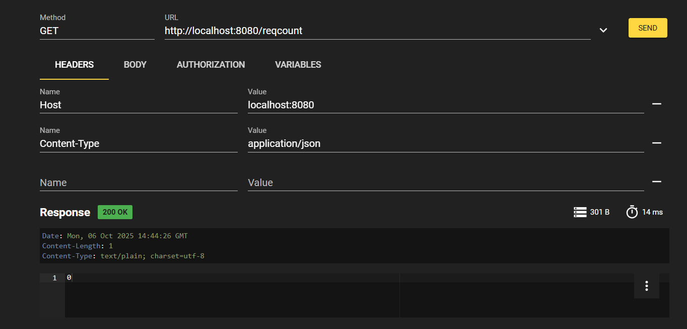

# Notes

Récupération des sources de la démo :

> go get gitlab.utc.fr/lagruesy/ia04/demos/restagentdemo
Celle-ci sera mise dans $HOME/go/pkg

Installer directement les exécutables :

> go install gitlab.utc.fr/lagruesy/ia04/demos/restagentdemo/cmd/launch-all-rest-agents@latest
> go install gitlab.utc.fr/lagruesy/ia04/demos/restagentdemo/cmd/launch-rcagt@latest
> go install gitlab.utc.fr/lagruesy/ia04/demos/restagentdemo/cmd/launch-rsagt@latest
Celles-ci seront installées dans $HOME/go/bin

